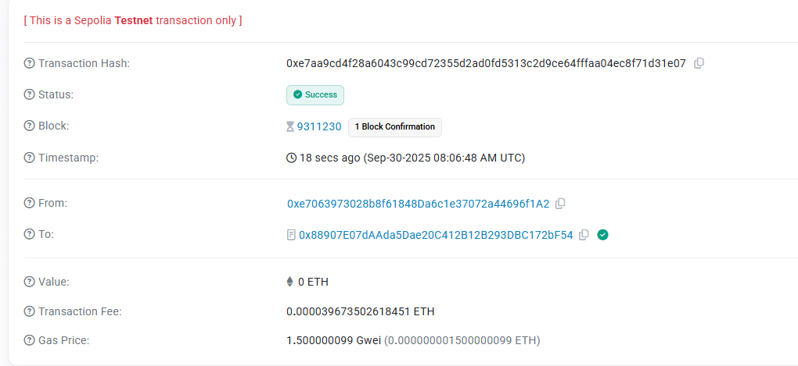

# Anonymous Court Investigation System

[](https://anonymous-court-investigation.vercel.app/)
[](https://sepolia.etherscan.io/address/0x88907E07dAAda5Dae20C412B12B293DBC172bF54)
[](LICENSE)

> **Privacy-Preserving Judicial Investigation System powered by Fully Homomorphic Encryption (FHE)**

A decentralized application (DApp) that leverages FHE technology to enable confidential judicial investigations while maintaining transparency and accountability on the blockchain.

## 🌐 Links

- **Live Application**: [https://anonymous-court-investigation.vercel.app/](https://anonymous-court-investigation.vercel.app/)
- **GitHub Repository**: [https://github.com/IrwinDenesik/AnonymousCourtInvestigation](https://github.com/IrwinDenesik/AnonymousCourtInvestigation)
- **Smart Contract**: `0x88907E07dAAda5Dae20C412B12B293DBC172bF54` (Sepolia Testnet)
- **Contract Verification**: [View on Etherscan](https://sepolia.etherscan.io/address/0x88907E07dAAda5Dae20C412B12B293DBC172bF54)

---

## 🎯 Core Concept

The **Anonymous Court Investigation System** revolutionizes judicial proceedings by combining blockchain transparency with cryptographic privacy. Using **Fully Homomorphic Encryption (FHE)**, the system enables:

### Privacy-First Judicial Operations
- **Encrypted Evidence Submission**: All evidence is encrypted on-chain, preserving confidentiality while maintaining verifiability
- **Anonymous Witness Testimonies**: Witnesses can submit testimonies without revealing their identity
- **Confidential Investigations**: Case details remain encrypted throughout the investigation process
- **Secure Verdict Computation**: Judicial decisions are made on encrypted data without exposing sensitive information

### Key Features
- 🔐 **FHE-Powered Privacy**: Compute on encrypted judicial data without decryption
- ⚖️ **Transparent Accountability**: All actions recorded immutably on blockchain
- 🕵️ **Anonymous Participation**: Protect witness and investigator identities
- 🛡️ **Role-Based Access Control**: Investigators, judges, and administrators with distinct permissions
- 📊 **Confidentiality Levels**: Granular control over evidence sensitivity (1-100 scale)
- 🔍 **Verifiable Evidence Chain**: Cryptographic proof of evidence authenticity

---

## 🏛️ System Architecture

### Smart Contract Components

#### Access Control
- **Administrator**: Contract owner with full system management rights
- **Authorized Investigators**: Can start investigations, submit evidence, and manage participants
- **Authorized Judges**: Can review evidence, submit verdicts, and complete investigations
- **Authorized Participants**: Case-specific access to confidential information

#### Investigation Lifecycle
1. **Initiation**: Investigator starts a new investigation with encrypted case ID
2. **Evidence Collection**: Submit encrypted evidence with type classification and confidentiality level
3. **Witness Testimonies**: Anonymous witnesses submit encrypted testimonies with credibility scores
4. **Judicial Review**: Judges examine encrypted evidence and submit verdicts
5. **Completion**: Investigation concludes with final verdict recorded on-chain
6. **Archival**: Completed investigations archived for historical record

#### Evidence Types
- **Document**: Legal documents, contracts, written statements
- **Testimony**: Verbal statements from witnesses or experts
- **Physical**: Material evidence descriptions and metadata
- **Digital**: Electronic evidence, logs, communications

#### Verdict Options
- **Not Guilty**: Insufficient evidence of wrongdoing
- **Guilty**: Evidence substantiates allegations
- **Insufficient Evidence**: Unable to reach definitive conclusion

---

## 🎬 Demo & Screenshots

### Video Demonstration
A complete walkthrough demonstrating the system's functionality is available in the repository:
- **Demo Video**: `AnonymousCourtInvestigation.mp4`

This video showcases:
- Wallet connection and authentication
- Starting a new investigation
- Submitting encrypted evidence
- Anonymous witness testimony submission
- Judicial verdict process
- Dashboard statistics and role management

### On-Chain Transaction Evidence


The screenshot demonstrates successful on-chain interactions, including:
- Investigation creation transactions
- Evidence submission confirmations
- Witness testimony recordings
- Verdict finalization events

---

## 💡 Use Cases

### 1. **Corporate Fraud Investigations**
- Confidential whistleblower reports
- Encrypted financial evidence
- Anonymous witness protection
- Transparent audit trail

### 2. **Criminal Justice**
- Protected witness identities
- Sealed evidence management
- Confidential case proceedings
- Verifiable judicial decisions

### 3. **Regulatory Compliance**
- Privacy-preserving audits
- Encrypted compliance reports
- Anonymous regulatory submissions
- Transparent investigation records

### 4. **Internal Corporate Investigations**
- HR misconduct investigations
- Intellectual property disputes
- Contract violation cases
- Employee protection mechanisms

---

## 🔧 Technology Stack

### Blockchain & Smart Contracts
- **Solidity**: Smart contract development
- **Ethereum (Sepolia Testnet)**: Blockchain network
- **FHE Libraries**: Fully Homomorphic Encryption implementation
- **Web3.js/Ethers.js**: Blockchain interaction

### Frontend
- **HTML5/CSS3**: Modern, responsive UI
- **Vanilla JavaScript**: Lightweight, efficient client-side logic
- **Font Awesome**: Professional iconography
- **CSS Grid/Flexbox**: Responsive layout design

### Cryptography
- **FHE (Fully Homomorphic Encryption)**: Privacy-preserving computation
- **Encrypted Data Types**: euint32, euint8 for confidential values
- **Zero-Knowledge Proofs**: Identity protection mechanisms

---

## 🎨 User Interface

### Dashboard Features
- **Statistics Overview**: Total investigations, active cases, evidence count, witness count
- **Role Indicators**: Visual display of user permissions (Investigator, Judge, Admin)
- **Real-Time Updates**: Live transaction monitoring and confirmation

### Investigation Management
- **Case Creation**: Start new investigations with encrypted case IDs
- **Participant Authorization**: Grant access to specific individuals
- **Status Tracking**: Monitor investigation progress (Pending, Active, Completed, Archived)

### Evidence & Testimony
- **Secure Submission Forms**: Upload encrypted evidence with metadata
- **Anonymity Preservation**: Submit testimonies without identity disclosure
- **Verification System**: Multi-party evidence validation

### Judicial Actions
- **Verdict Submission**: Judges submit decisions with confidence levels
- **Case Completion**: Finalize investigations with permanent records
- **Archive Management**: Long-term case storage and retrieval

---

## 🔒 Security Features

### Cryptographic Protection
- **End-to-End Encryption**: All sensitive data encrypted before blockchain submission
- **FHE Computation**: Process encrypted data without exposure
- **Key Management**: Secure cryptographic key handling

### Access Control
- **Role-Based Permissions**: Granular access control for different user types
- **Investigation-Specific Authorization**: Per-case access management
- **Admin Override Protection**: Prevention of unauthorized privilege escalation

### Data Integrity
- **Immutable Records**: Blockchain-based tamper-proof storage
- **Cryptographic Hashing**: Evidence integrity verification
- **Timestamp Verification**: Accurate chronological record-keeping

---

## 📊 Smart Contract Details

### Contract Address
```
0x88907E07dAAda5Dae20C412B12B293DBC172bF54
```

### Network Information
- **Network**: Ethereum Sepolia Testnet
- **Chain ID**: 11155111
- **Explorer**: [Sepolia Etherscan](https://sepolia.etherscan.io)

### Key Functions

#### Administrative Functions
- `authorizeInvestigator(address)`: Grant investigator privileges
- `authorizeJudge(address)`: Grant judge privileges
- `revokeInvestigatorAccess(address)`: Revoke investigator role
- `revokeJudgeAccess(address)`: Revoke judge role

#### Investigation Functions
- `startInvestigation(uint32)`: Initialize new investigation
- `authorizeParticipant(uint32, address)`: Grant case access
- `completeInvestigation(uint32)`: Finalize investigation
- `archiveInvestigation(uint32)`: Archive completed case

#### Evidence & Testimony Functions
- `submitEncryptedEvidence(uint32, uint8, uint32)`: Submit evidence
- `submitAnonymousWitnessTestimony(uint32, uint8, uint32)`: Anonymous testimony
- `verifyEvidence(uint32, uint32)`: Validate evidence authenticity
- `submitJudicialVerdict(uint32, uint8, uint8)`: Judge's decision

#### Query Functions
- `getInvestigationBasicInfo(uint32)`: Retrieve case overview
- `getInvestigationTimeInfo(uint32)`: Timing details
- `getInvestigationCounts(uint32)`: Evidence and witness statistics
- `isAuthorizedForInvestigation(uint32, address)`: Check access permissions

---

## 🌟 Advantages of FHE in Judicial Systems

### Privacy Preservation
- **Confidential Computation**: Process sensitive legal data without exposure
- **Witness Protection**: Absolute anonymity for vulnerable participants
- **Evidence Secrecy**: Maintain confidentiality while proving authenticity

### Transparency & Accountability
- **Public Verification**: Anyone can verify process integrity
- **Immutable Audit Trail**: Permanent record of all actions
- **Tamper-Proof Evidence**: Cryptographic guarantees against manipulation

### Efficiency & Trust
- **Reduced Intermediaries**: Direct cryptographic verification
- **Global Accessibility**: Participate from anywhere securely
- **Trustless System**: No need to trust centralized authorities

---

## 🎓 Educational Value

This project serves as a comprehensive example of:
- **FHE Integration**: Practical implementation of homomorphic encryption
- **DApp Development**: Modern decentralized application architecture
- **Smart Contract Design**: Complex role-based access control
- **Privacy-Preserving Systems**: Real-world cryptographic applications
- **Judicial Technology**: Innovation in legal proceedings

---

## 🤝 Contributing

We welcome contributions from the community! Whether you're interested in:
- Enhancing cryptographic implementations
- Improving user interface design
- Adding new judicial features
- Writing documentation
- Reporting bugs or suggesting features

Please feel free to open issues or submit pull requests on our [GitHub repository](https://github.com/IrwinDenesik/AnonymousCourtInvestigation).

---

## 📜 License

This project is licensed under the MIT License - see the LICENSE file for details.

---

## 🙏 Acknowledgments

- **Zama**: For pioneering FHE technology and libraries
- **Ethereum Foundation**: For blockchain infrastructure
- **Open Source Community**: For continuous support and innovation

---

## 📞 Contact & Support

For questions, suggestions, or collaboration opportunities:
- **GitHub Issues**: [Report bugs or request features](https://github.com/IrwinDenesik/AnonymousCourtInvestigation/issues)
- **Live Demo**: [Try the system](https://anonymous-court-investigation.vercel.app/)

---

## ⚖️ Disclaimer

This system is designed for educational and demonstration purposes. It showcases the potential of FHE technology in judicial applications. For production use in legal proceedings, consult with legal professionals and conduct thorough security audits.

---

**Built with ❤️ for a more private and transparent judicial future**

*Powered by Fully Homomorphic Encryption Technology*